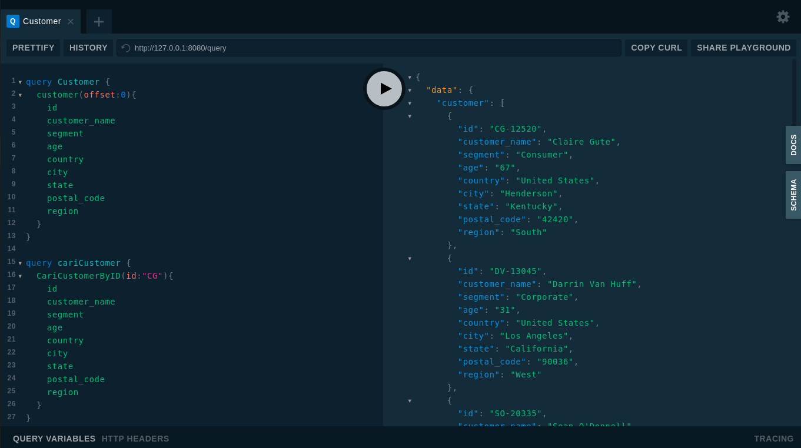

<p align="right">
بِسْــــــــــــــمِ اللَّهِ الرَّحْمَنِ الرَّحِيم 
</p>

# Supermarket GraphQL API

Project sederhana membuat GraphQL API menggunakan Golang dengan database Postgres. Package dipakai gqlgen, gorm, postgres

# How To Install

Restore data terlebih dahulu sebelum menggunakan program.
Silahkan download datanya [disini](https://drive.google.com/uc?export=download&id=1jmbhhgUJN-ITSd8r0HaTyDT68noDd45r)
- Download Go terlebih dahulu [disini](https://golang.org/dl/)
- Download repo [ini](https://github.com/afrizal423/go-supermarket-gpql/archive/master.zip)
- Masuk kedalam foldernya
- Rename file ```.env.sample``` menjadi ```.env```
- buka file ```.env```, silahkan ubah sesuai konfigurasi yang dimiliki
- Jalankan perintah ```go run main.go``` untuk menjalankan program

### Screenshot



Live Demo [supermarket-gpql.herokuapp.com/](https://supermarket-gpql.herokuapp.com/)

#### Note

Setiap ada perubahan pada file ekstensi .graphqls, jalankan perintah dibawah ini untuk mengenerate ke golang
```
go run github.com/99designs/gqlgen generate
```